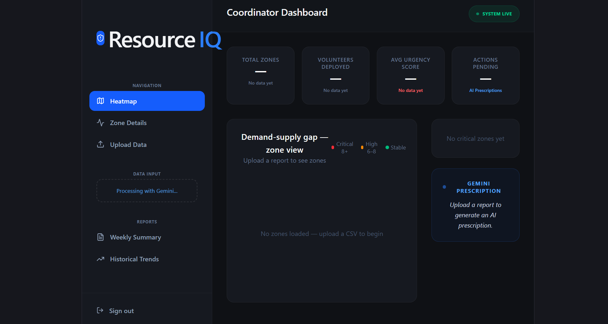
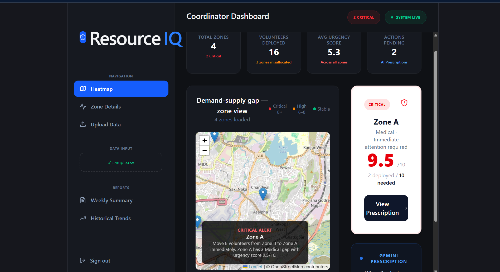
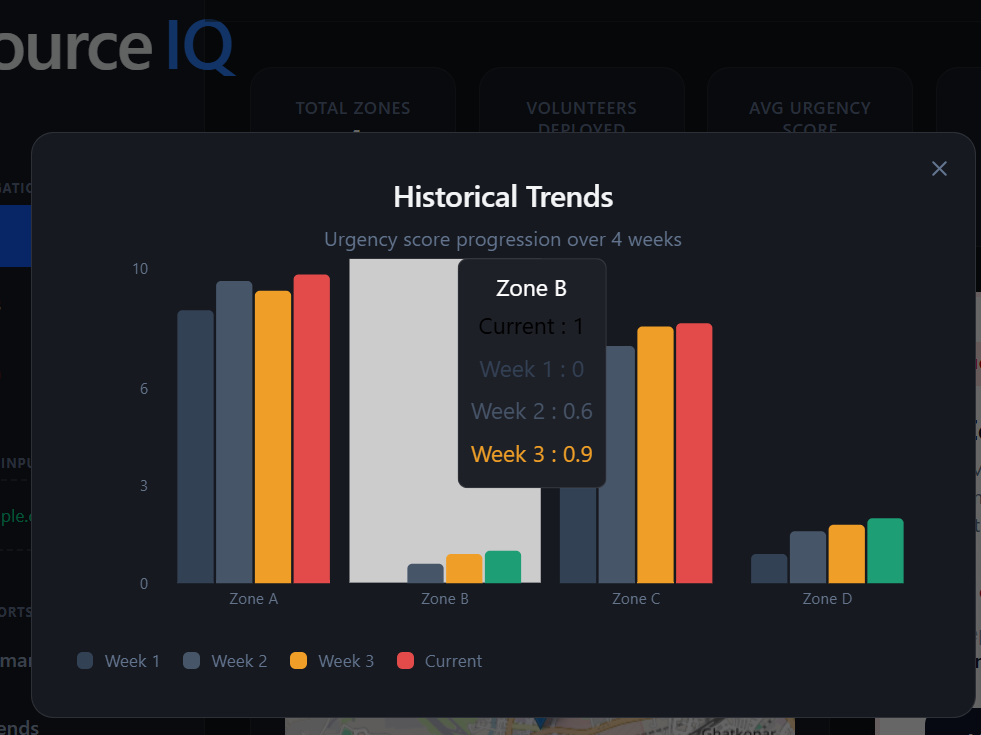
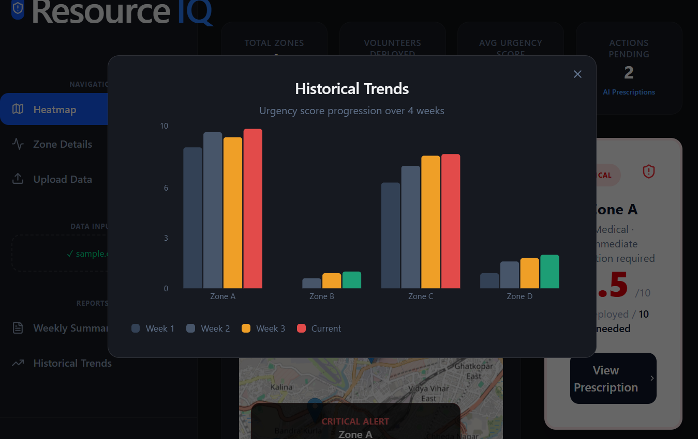
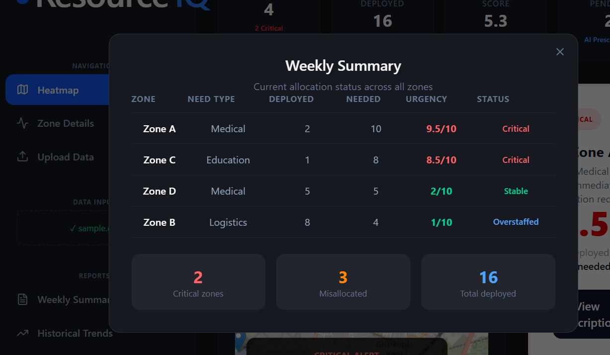

# 🚀 ResourceIQ

> AI-powered intelligence layer for optimizing volunteer allocation in NGOs

---

## Problem

NGOs often struggle with **resource misallocation**.  
Some zones remain understaffed while others are overstaffed, leading to inefficient crisis response.

---

## Solution

**ResourceIQ** analyzes field data using AI to:

- Detect demand-supply gaps
- Identify critical zones
- Recommend optimal volunteer redistribution

---

## Features

- **Dashboard Insights**  
  Real-time metrics across all zones

- **Live Heatmap Visualization**  
  Identify critical and high-risk zones instantly

- **AI-Powered Data Processing**  
  Upload CSV reports and extract structured insights

- **Smart Prescriptions**  
  Actionable recommendations like:

  > Move volunteers from overstaffed zones to critical ones

- **Historical Trends**  
  Track urgency changes over time

---

## Tech Stack

- **Frontend:** React + TypeScript + Tailwind CSS
- **Backend:** Node.js + Express
- **AI:** Gemini API
- **Database:** Firebase Firestore
- **Maps:** Leaflet / OpenStreetMap
- **Deployment:** Vercel

---

## MVP Snapshots

### Dashboard



### Heatmap



### AI Prescription



### Historical Trends



### Weekly Summary



---

## Demo Video

👉 https://youtu.be/A4GwkvyElmg

---

## Live MVP

👉 https://solutionchallenge-alpha.vercel.app/

---

## Setup Instructions

### 1. Clone repo

```bash
git clone https://github.com/your-username/resourceiq.git
cd resourceiq
```

### 2. Install dependencies

npm install

### 3. Create .env file

VITE_API_URL=http://localhost:3001
VITE_FIREBASE_API_KEY=
VITE_FIREBASE_AUTH_DOMAIN=
VITE_FIREBASE_PROJECT_ID=

### 4. Run project

npm run dev

### Sample Data

Upload CSV files in this format:

Zone,VolunteersNeeded,VolunteersDeployed,UrgencyScore,NeedType
Zone A,20,12,9,Medical
Zone B,15,18,4,Food
